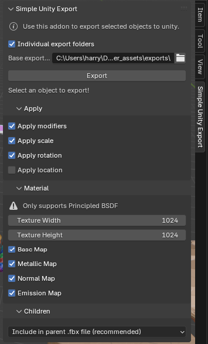
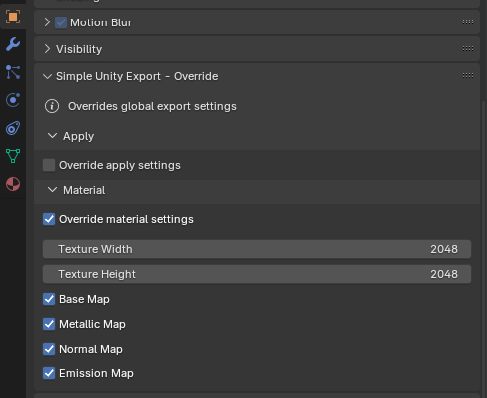

# simple-unity-exporter

Simple addon to export *meshes*, *curves* and *texts* from blender to unity without having to manually apply modifiers, apply transforms and bake textures.

_Tested with Blender 4.3.2 and Unity 6_

⚠️ I developed this addon for personal uses. There might be some issues. If you encounter a bug please create an issue.

## How to use this addon
1. Drag the "FixTextureMaps.cs" file into your unity asset folder (only once)
2. Select the objects you want to export
3. Open the addon inside the 3D View using "N"
3. Choose an export folder (not inside your unity asset folder)
4. Click export
5. Drag the whole export folder into your unity project
6. If an popup with "Fix now" appears, click "Fix now"

## Export Settings
The export settings you define inside the 3D View are used for all objects inside the same scene. If you want to change the export settings for particular objects go to `Object Properties > Simple Unity Export - Override`.

### Apply
In this section you configure if modifiers, scale, rotation and location are applied before exporting. Your original model is untouched - no worries!

### Material
In this section you configure how materials are exported. The individual maps correspond to the Principled BSDF shader settings. 

The texture width and height define the resolution. It is recommended to stay in an area between 512 and 2048. Higher values might take multiple minutes.

The option "Smart unwrap" configures if you want your model to be unwrapped automatically using the smart uv project. This only produces good results if you just use "Generated" texture coordinates inside your material.

### Children
In this section you configure how children of selected objects are treated. If you select "Include in parent .fbx file" or "Export in seperated .fbx file" don't select them on exporting. Otherwise you will export them twice.

## Limitations for materials
Only works partly with Principled BSDF. The following shader settings are supported:
- BSDF Normal Map Input (any node input, gets baked)
- BSDF Base Color Input (any node input, gets baked)
- BSDF Roughness Value (only a fixed value)
- BSDF Metallic Input (any node input, gets baked)
- BSDF Emission Color Input (any node input, gets baked)
- BSDF Emission Strength Value (only a fixed value)

## Limitations for UV Maps

Your UV map must lie inside the 0-1 scale. Select `UV -> Constrain to Image Bounds` to ensure this.